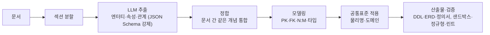

# nlxpg 소개

업무 문서를 올리면 PostgreSQL 데이터베이스 설계 초안을 만들어 주는 도구입니다. 결과는 테이블 정의서, ERD, 실행 가능한 DDL입니다. 명명과 타입에는 행정안전부 공공데이터 공통표준을 적용합니다.

버전 0.5 (2026-10-01) 기준입니다.

## 왜 만드나

새 시스템의 DB를 설계할 때는 규정·업무 매뉴얼·요구사항 문서를 읽고, 관리할 대상(엔터티)과 항목(속성)을 찾아, 표준 용어로 이름을 붙이는 일을 사람이 처음부터 합니다. 같은 개념이 문서마다 다른 이름으로 나오고(고객 / 거래처 / Customer), 공통표준을 찾아 맞추는 데도 시간이 많이 듭니다.

nlxpg는 이 초안 작성을 자동화합니다. 설계자는 처음부터 만드는 대신 **초안을 검토하고 고치는 일**에 집중합니다.

자매 프로젝트인 pgxnl은 DB 스키마를 보고 자연어 질문을 SQL로 바꿉니다(Text-to-SQL). nlxpg는 그 반대 방향으로, 문서에서 스키마를 만듭니다(NL → PG). nlxpg가 만든 테이블·컬럼 설명은 pgxnl의 입력으로 그대로 쓸 수 있습니다.

## 무엇을 해 주나

| 입력 | 출력 |
| --- | --- |
| 업무 문서 (Markdown·텍스트. 선택 설치 시 PDF·DOCX·PPTX·HTML) | 테이블 정의서 (한글 논리명, 영문 물리명, 도메인, 타입, 근거 문장) |
| | ERD (Mermaid, SVG 저장) |
| | PostgreSQL DDL (샌드박스에서 실제로 실행해 검증) |
| | 검증 결과: 공통표준 준수율, 정규형(1NF·2NF·3NF) 점검, 린트 |

모든 테이블과 컬럼에는 **어느 문서의 어느 절에서 나왔는지(근거)** 가 붙습니다. 화면에서 근거를 누르면 원문의 해당 절로 이동합니다.

## 어떻게 동작하나

- **LLM은 추출에만 씁니다.** 문서에서 개념을 찾는 일만 LLM이 하고, 키·관계 설계와 표준 적용, DDL 생성은 규칙으로 처리합니다. 같은 추출 결과에서는 항상 같은 스키마가 나옵니다.
- **출력 형식을 강제합니다.** LLM이 정해진 JSON 구조로만 답하게 하고(vLLM guided decoding), 그래도 틀리면 오류를 알려 주고 한 번 더 요청합니다.
- **공통표준을 따릅니다.** 공통표준 용어가 있으면 그대로 쓰고, 없으면 표준 단어를 조합하고, 그래도 안 되면 비표준으로 표시합니다. 날짜는 PostgreSQL의 `DATE`, 물리명은 소문자로 맞춥니다([ADR-0005](adr/0005-naming-common-standard-postgresql-adaptation.md)).

## 화면

웹 브라우저로 씁니다(로그인 필요).

| 메뉴 | 하는 일 |
| --- | --- |
| 새 설계 | 문서를 올리고 모델을 골라 설계를 시작합니다. 진행 상황이 실시간으로 보입니다 |
| 실행 이력 | 결과 요약, ERD, 정의서, 관계, 검증, DDL, 원문, 사람 검토(6개 항목 점수) |
| 표준 검증 | 기존 DDL이나 운영 DB의 컬럼이 공통표준을 얼마나 지키는지 검사하고 매핑정보 CSV를 냅니다 |
| 정규형 검사 | 설계 결과의 정규형 위반, 관계 누락, 파생 속성 의심을 찾습니다 |
| 공통표준 | 이름으로 표준 물리명·도메인을 찾고, 도메인·용어·단어를 검색합니다 |
| 관리 | 사용자, 모델 설정(LLM), 시스템 정보 |

설계가 실패하거나 결과가 이상하면 **디버그 모드**로 다시 실행합니다. LLM에 무엇을 보냈고 무엇을 받았는지 호출마다 확인할 수 있습니다.

## 보안

| 원칙 | 구현 |
| --- | --- |
| 사내 문서는 밖으로 나가지 않는다 | 기본 LLM은 사내 서버의 오픈 모델(Qwen3, vLLM)입니다. 외부 API(Claude)는 "사내 문서"가 아닌 실행에서 직접 고를 때만 쓸 수 있고, 서버가 사내 문서에는 거부합니다([ADR-0008](adr/0008-external-llm-for-non-internal-documents.md)) |
| 자기 실행만 본다 | 계정마다 자기가 만든 실행만 보고, 관리자만 전체를 봅니다([ADR-0006](adr/0006-web-ui-accounts-and-access.md)) |
| 비밀값은 암호화한다 | LLM 키는 암호화해 DB에 저장하고 화면에 다시 보이지 않습니다. 비밀번호는 해시만 저장합니다 |
| 지우면 남지 않는다 | 실행을 지우면 원문, 업로드 파일, 디버그 기록이 함께 지워집니다 |

## 지금 수준 (0.5)

**되는 것**
- 문서 여러 개 → 정합된 스키마 하나. 표준 적용, 샌드박스 검증, 정규형 점검, 사람 검토 기록까지 한 화면에서 할 수 있습니다.
- 공개 샘플 문서(거래처 관리 규정)에서 테이블 6개, 관계 5개를 만들고 샌드박스를 통과했습니다.
- 설치 스크립트 한 번으로 다른 서버에 설치할 수 있습니다(시스템 DB 생성, systemd 서비스 포함).

**아직 안 되는 것**
- **정량 평가 전입니다.** 정답 스키마와 비교한 점수(테이블·컬럼 F1 등)를 아직 내지 않았습니다. 평가셋(BIRD 역복원 등)을 만드는 것이 다음 단계입니다. 그래서 0.5는 "써 보고 의견을 받는 시험판"입니다.
- HWP/HWPX와 스캔본은 받지 않습니다.
- 같은 개념의 통합은 이름·별칭이 같을 때만 됩니다(의미가 같은 다른 이름은 못 합칩니다).
- 대리키 이름(`{테이블}_id`)이 공통표준 용어가 아니라 표준 준수율이 낮게 나옵니다(결정 대기).
- 검증에 실패해도 설계를 자동으로 고치지는 않습니다.

## 다음 계획

1. 평가 기반: 정답이 있는 테스트 문서를 만들어 점수를 냅니다([ADR-0003](adr/0003-evaluation-semantic-schema-matching.md)).
2. 의미 기반 정합: 이름이 달라도 같은 개념을 합칩니다.
3. 사내 문서 파일럿: HWP 지원, 사람 검토 루프, pgxnl 연계.

사용법은 [사용자 매뉴얼](user-guide.md), 자세한 목표와 일정은 [기획서](plan.md), 설계 결정은 [ADR 목록](adr/README.md)에 있습니다.
