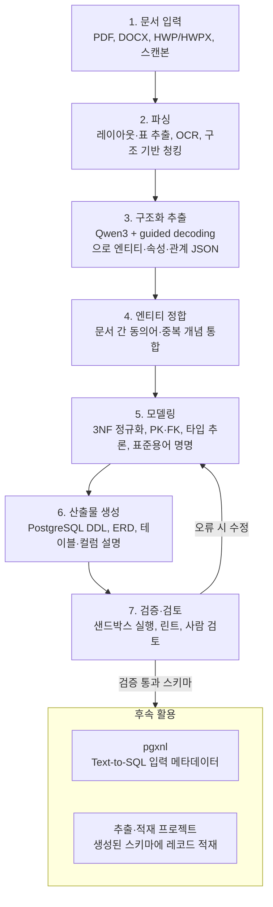

# nlxpg 프로젝트 기획서

2026-09-30 · Youngki Ku

## 개요

nlxpg는 문서를 읽어 엔티티를 식별하고, PostgreSQL 테이블·컬럼 스키마(DDL)를 자동으로 설계하는 Text-to-Database 프로젝트다. 이름은 pgxnl(PG → NL, Text-to-SQL)의 역방향인 NL → PG를 뜻한다.

두 프로젝트는 서로를 받쳐 준다. pgxnl은 스키마가 주어졌을 때 질의를 만들고, nlxpg는 그 스키마 자체를 문서에서 만든다. nlxpg가 생성한 테이블·컬럼 설명은 pgxnl의 입력 메타데이터로 그대로 쓰인다.

두 프로젝트 모두 BIRD 생태계를 기반으로 한다. pgxnl에서 이미 BIRD DB를 PostgreSQL로 이관했으므로, 평가 인프라를 공유할 수 있다.

## 목표와 범위

1차 목표는 문서만 입력받아, 검증을 통과한 PostgreSQL 스키마 초안을 자동으로 만드는 것이다. 레코드 추출·적재는 범위에서 빼고 별도 프로젝트로 진행한다.

| 구분 | 내용 |
| --- | --- |
| 입력 | 문서 (PDF, DOCX, HWP/HWPX, 스캔본) |
| 출력 | PostgreSQL DDL, ERD, 테이블·컬럼 설명 (한글 논리명과 영문 물리명) |
| 포함 | 엔티티·속성·관계 식별, 엔티티 정합, 정규화, PK/FK 설계, 타입 추론, 명명 표준 적용, DDL 검증 |
| 제외 | 문서 내용을 레코드로 추출해 적재하는 작업 (별도 프로젝트) |
| 제외 | 운영 DB 반영과 마이그레이션 |

미정 사항: 1차 대상 문서 유형과 도메인. 명명 표준은 공공데이터 공통표준을 따르기로 했다([ADR-0005](adr/0005-naming-common-standard-postgresql-adaptation.md)).

## 시스템 아키텍처

파이프라인은 7단계로 구성되며, 검증에서 오류가 나면 모델링 단계로 돌아가 수정한다.



검증을 통과한 스키마만 pgxnl과 추출·적재 프로젝트로 넘어간다.

## 핵심 기술 요소

온프레미스 오픈 모델(Qwen3)과 vLLM만으로 전 과정을 구성하고, 품질의 핵심은 구조화 추출과 엔티티 정합에 둔다.

| 영역 | 기술 | 비고 |
| --- | --- | --- |
| 문서 파싱 | Docling, Unstructured, MinerU, OCR | HWP/HWPX 처리 방법을 초기에 확정 |
| 구조화 추출 | Qwen3 + vLLM guided decoding (JSON Schema 강제) | 엔티티·속성·관계를 스키마에 맞춘 JSON으로 출력 |
| 엔티티 정합 | 임베딩 유사도 클러스터링 + LLM 판정, 동의어 사전 | "고객/거래처/Customer" 같은 중복 개념 통합, 가장 어려운 단계 |
| 모델링 | 3NF 정규화, PK/FK·카디널리티 결정, N:M 연결 테이블, 타입 추론 | 타입과 길이는 문서의 값 예시로 추론 |
| 명명 표준 | 표준용어사전 기반 한글 논리명 ↔ 영문 물리명 매핑 | 실무 활용도를 좌우 |
| 검증 | 샌드박스 PostgreSQL 실행, 규칙 기반 린트 | pgxnl의 PostgreSQL ANTLR4 문법 재활용 가능 |
| 시각화 | Mermaid 또는 DBML ERD | 사람 검토용 |

## 스키마 중간 표현

모든 단계는 DBMS 중립적인 JSON 중간 표현을 주고받고, PostgreSQL DDL은 마지막에 이 표현에서 생성한다. 이 형식은 추출·적재 프로젝트와의 인터페이스이므로 1단계에서 가장 먼저 확정한다. 아래는 논의용 초안이다.

```json
{
  "schema_version": "0.1",
  "source_documents": [{"doc_id": "D001", "title": "거래처 관리 규정"}],
  "entities": [
    {
      "logical_name": "거래처",
      "physical_name": "customer",
      "description": "상품을 구매하는 법인 또는 개인",
      "aliases": ["고객", "Customer"],
      "attributes": [
        {
          "logical_name": "거래처명",
          "physical_name": "customer_name",
          "data_type": "varchar(100)",
          "nullable": false,
          "is_primary_key": false,
          "value_examples": ["(주)가나상사"],
          "evidence": [{"doc_id": "D001", "span": "제3조"}]
        }
      ],
      "primary_key": ["customer_id"]
    }
  ],
  "relationships": [
    {
      "name": "places",
      "from_entity": "customer",
      "to_entity": "order",
      "cardinality": "1:N",
      "foreign_key": {"table": "order", "columns": ["customer_id"]},
      "evidence": [{"doc_id": "D001", "span": "제5조"}]
    }
  ]
}
```

- **evidence:** 모든 테이블·컬럼·관계에 근거 문서 위치를 남겨, 사람 검토와 오류 추적에 쓴다.
- **aliases:** 엔티티 정합 단계의 동의어 통합 결과를 보존한다.
- **value_examples:** 타입 추론의 근거이며, 추출·적재 프로젝트에서도 참고한다.

미정: 필드 이름과 필수 여부, 버전 관리 방식.

## 인프라 요구사항

기존 온프레미스 GPU와 vLLM 서빙 환경을 재사용하고, pgxnl과 평가용 PostgreSQL을 공유한다. 모델 크기와 GPU 배정은 2단계 베이스라인 결과를 보고 확정한다.

| 항목 | 요구사항 | 상태 |
| --- | --- | --- |
| LLM | Qwen3 계열, vLLM 서빙, guided decoding 지원 | 모델 크기 미정 |
| 컨텍스트 길이 | 장문 문서(평균 약 43K 토큰)를 섹션 단위로 처리할 수 있는 길이 | 섹션 분할 전략과 함께 결정 |
| 임베딩 모델 | 엔티티 정합과 평가 매칭용, 한국어 지원 | 미정 |
| GPU | 추출용 LLM과 임베딩 모델 동시 서빙 | 배정 규모 미정 |
| PostgreSQL | DDL 샌드박스 실행용 격리 인스턴스, pgxnl의 BIRD DB 공유 | 기존 환경 활용 |
| 문서 파싱 | Docling 등 파싱 도구, OCR 엔진, HWP 변환 도구 | 도구 선정 필요 |

## 평가 방법

정답 스키마가 있는 문서로 "스키마를 얼마나 복원하는가"를 측정한다. 스키마 생성 전용 벤치마크가 드물어, 기존 데이터셋 세 가지를 조합한다.

| 데이터셋 | 활용 방식 | 특징 | 한계 |
| --- | --- | --- | --- |
| [SQUiD](https://doi.org/10.18653/v1/2025.emnlp-main.1629) (EMNLP 2025) | 텍스트 → 관계형 DB 생성, 다중 테이블 스키마 합성 포함 | nlxpg와 과제 정의가 가장 가까움 | 단순 설명문 기반, 상세 검토 필요 |
| [Doc2DB-Bench](https://github.com/SetonLiang/Doc2DB-Bench) 변형 | 정답 스키마를 숨기고 문서만으로 스키마 유도 | 42개 스키마, 203개 문서, 평균 약 43K 토큰, BIRD/Spider 기반 | 원래는 스키마가 주어지는 추출 과제, 영어 전용 |
| BIRD 역복원 | database\_description의 컬럼 설명을 문서로 보고 스키마 복원 | BIRD는 이미 PostgreSQL로 이관 완료 | 설명문이 실제 업무 문서와 다름 |

지표:

- 테이블 매칭 정밀도·재현율·F1
- 컬럼 매칭 정밀도·재현율·F1
- PK/FK 일치율, 데이터 타입 정확도
- DDL 실행 성공률

이름은 정답과 다르게 나오는 경우가 많으므로, 테이블·컬럼 매칭은 문자열 일치가 아니라 임베딩 또는 LLM 판정 기반 의미 매칭으로 정의한다.

출처: [Doc2DB-Bench 논문](https://arxiv.org/html/2608.08459)

## 사람 검토 절차

자동 지표가 놓치는 설계 품질은 DBA 관점의 체크리스트로 검토하고, 항목별 점수를 자동 지표와 함께 기록한다. 검토자는 문서와 생성 스키마, 근거(evidence)를 나란히 보고 판단한다.

| 검토 항목 | 확인 내용 | 점수 |
| --- | --- | --- |
| 엔티티 완전성 | 문서의 핵심 개념이 빠짐없이 테이블로 도출되었는가 | 1~5 |
| 정규화 | 중복 속성이나 반복 그룹 없이 3NF를 만족하는가 | 1~5 |
| 키와 관계 | PK가 적절하고, FK와 카디널리티가 문서 내용과 맞는가 | 1~5 |
| 타입 | 데이터 타입과 길이가 값 예시에 비추어 타당한가 | 1~5 |
| 명명 | 표준용어 규칙을 따르고, 논리명과 물리명이 일관된가 | 1~5 |
| 근거 | 각 테이블·컬럼의 evidence가 실제 문서 내용과 일치하는가 | 1~5 |

- 1단계에서 소수의 샘플로 검토자 간 점수 편차를 확인하고 기준 문구를 다듬는다.
- 같은 결과를 LLM 판정으로도 채점해, 자동 매칭 지표의 신뢰도를 점검하는 데 쓴다.

미정: 검토자 지정, 샘플 수와 검토 주기.

## 개발 로드맵

평가 기반을 먼저 만들고, 각 단계는 게이트 기준을 통과해야 다음으로 넘어간다.

| 단계 | 이름 | 주요 작업 | 통과 게이트 |
| --- | --- | --- | --- |
| 1 | 평가 기반 구축 | BIRD 역복원 평가셋, Doc2DB-Bench 변형, SQUiD 검토, 매칭 지표 정의 | 평가셋·지표 확정 |
| 2 | 베이스라인 | 단일 문서 → DDL, 추출용 JSON Schema, Qwen3 + guided decoding | 베이스라인 점수 확보 |
| 3 | 파이프라인 고도화 | 엔티티 정합, 정규화·키·타입, 표준용어 명명, DDL 샌드박스 검증 | DDL 실행 통과 |
| 4 | 실문서 파일럿 | 사내 문서 적용(HWP·스캔본 포함), 사람 검토 루프, pgxnl 연계 데모 | - |

단계별 일정과 게이트의 목표 수치는 아직 정하지 않았다.

## 성공 기준

목표 수치는 2단계 베이스라인 점수를 본 뒤 확정하고, 그 전까지는 게이트별로 무엇을 측정할지만 고정한다.

| 게이트 | 측정 지표 | 목표 수치 | 확정 시점 |
| --- | --- | --- | --- |
| 1 → 2: 평가셋·지표 확정 | 평가셋 구성 완료, 의미 매칭과 수작업 판정의 일치율 | 일치율 목표 미정 | 1단계 중 |
| 2 → 3: 베이스라인 점수 확보 | 테이블·컬럼 F1, PK/FK 일치율, 타입 정확도 | 기록만 (목표 없음) | - |
| 3 → 4: DDL 실행 통과 | DDL 실행 성공률, 테이블·컬럼 F1 개선 폭, 사람 검토 평균 점수 | 미정 | 2단계 종료 시 |
| 4 완료: 파일럿 | 사내 문서 스키마의 사람 검토 점수, 수정 없이 쓸 수 있는 비율 | 미정 | 3단계 종료 시 |

## 일정과 역할 분담

일정과 담당자는 아직 정하지 않았다. 아래 표를 팀 회의에서 채운다.

| 단계 | 기간 | 담당 |
| --- | --- | --- |
| 1. 평가 기반 구축 |  |  |
| 2. 베이스라인 |  |  |
| 3. 파이프라인 고도화 |  |  |
| 4. 실문서 파일럿 |  |  |

역할별로 필요한 작업:

| 역할 | 주요 작업 | 담당 |
| --- | --- | --- |
| LLM·파이프라인 | 추출 프롬프트와 JSON Schema, vLLM 서빙, 엔티티 정합 |  |
| 데이터 모델링 (DBA) | 정규화·키·타입 규칙, 명명 표준, 사람 검토 기준 |  |
| 평가 | 평가셋 구축, 의미 매칭 로직, 지표 산출 |  |
| 문서 처리 | 파싱 도구 선정, HWP/OCR 처리 |  |
| 연계 | pgxnl 연계 데모, WKC 용어 매핑 |  |

## 데이터 보안·취급 기준

사내 문서는 온프레미스 환경 밖으로 나가지 않는다. 공개 벤치마크와 사내 문서는 저장소와 접근 권한을 분리해 관리한다.

| 구분 | 공개 벤치마크 (SQUiD, Doc2DB-Bench, BIRD) | 사내 문서 (4단계 파일럿) |
| --- | --- | --- |
| 처리 위치 | 온프레미스 | 온프레미스, 외부 API 호출 금지 |
| 저장 위치 | 프로젝트 저장소 또는 공유 스토리지 | 접근 통제된 별도 스토리지, 코드 저장소에 커밋 금지 |
| 접근 권한 | 팀 전체 | 파일럿 참여자로 한정 |
| 로그·산출물 | 제한 없음 | 프롬프트·추출 결과·evidence에 원문이 남으므로 원문과 같은 등급으로 관리 |
| 보관 기간 | 제한 없음 | 파일럿 종료 후 삭제 또는 보관 기간 지정 (미정) |

미정: 파일럿 대상 문서의 보안 등급 확인 절차와 승인자.

## 리스크와 연계 계획

가장 큰 리스크는 스키마 설계에 정답이 하나가 아니라는 점이다. 자동 지표와 사람 검토를 함께 운영한다.

| 리스크 | 대응 |
| --- | --- |
| 같은 문서에서도 타당한 스키마가 여럿 나옴 | 의미 기반 매칭 지표와 사람 검토 점수를 병행 |
| 오픈 모델의 성능 격차 (Doc2DB-Bench 추출 과제에서 Qwen2.5-72B 전체 F1 36.07, GPT-5.4 75.25) | 추출·정합·모델링으로 단계를 쪼개고 guided decoding으로 형식 오류 제거 |
| 장문 문서 (평균 약 43K 토큰) | 섹션 단위로 추출한 뒤 엔티티 정합 단계에서 병합 |
| 한국어 평가셋 부재 | Doc2DB-Bench의 공개 역합성 파이프라인으로 한국어 문서 생성 |
| 실제 사내 문서의 품질 (HWP, 스캔본) | 파싱 단계 결과를 별도로 검증 |

연계 계획:

- **pgxnl:** nlxpg가 만든 스키마와 컬럼 설명을 Text-to-SQL 입력으로 사용해, 문서 → DB → 자연어 질의로 이어지는 엔드투엔드 데모를 구성
- **추출·적재 프로젝트:** nlxpg 스키마에 문서 레코드를 채우는 후속 프로젝트로, Doc2DB-Bench 원본을 평가셋으로 사용
- **WKC:** 생성된 테이블·컬럼 설명을 비즈니스 용어(glossary)와 매핑해 거버넌스와 연결
