# nlxpg 사용자 매뉴얼

웹 화면으로 nlxpg를 쓰는 방법입니다. 1~9장은 모든 사용자, 10장은 관리자를 위한 내용입니다. 설치는 [install.md](install.md), 프로그램 소개는 [overview.md](overview.md)를 봅니다.

버전 0.5 기준입니다.

## 목차

1. [시작하기](#1-시작하기)
2. [따라 하기: 한빛항공사 예제](#2-따라-하기-한빛항공사-예제)
3. [새 설계](#3-새-설계)
4. [실행 결과 보기](#4-실행-결과-보기)
5. [사람 검토](#5-사람-검토)
6. [표준 검증](#6-표준-검증)
7. [정규형 검사](#7-정규형-검사)
8. [공통표준 조회](#8-공통표준-조회)
9. [내 설정](#9-내-설정)
10. [관리자 기능](#10-관리자-기능)
11. [문제 해결](#11-문제-해결)

---

## 1. 시작하기

### 접속과 로그인

브라우저에서 `http://<서버 주소>:8200`에 접속합니다. 계정은 관리자에게 받습니다.

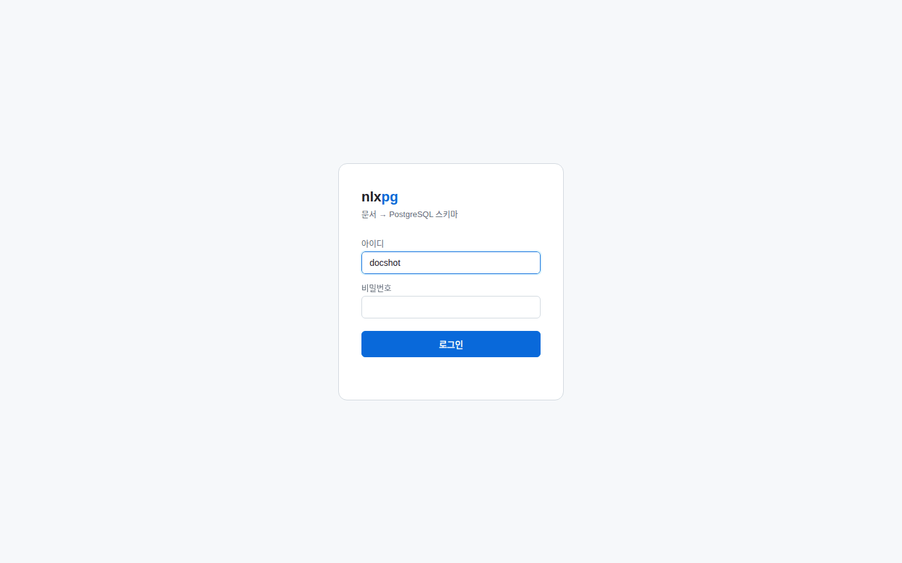

- 처음 로그인하거나 관리자가 비밀번호를 초기화한 뒤에는 **비밀번호를 바꾸는 화면**이 먼저 나옵니다. 새 비밀번호는 8자 이상이고, 숫자와 문자를 섞어야 합니다.
- 로그인은 12시간 유지됩니다. 비밀번호를 바꾸면 다른 곳의 로그인이 끊깁니다.

### 화면 구성

왼쪽에 메뉴가 있고, 메뉴를 고르면 오른쪽에 화면이 나옵니다.

| 메뉴 | 하는 일 |
| --- | --- |
| 설계 → 새 설계 | 문서를 올려 설계를 시작합니다 |
| 설계 → 실행 이력 | 지금까지 실행한 설계 결과를 봅니다 |
| 검증 → 표준 검증 | 스키마가 공통표준을 얼마나 지키는지 검사합니다 |
| 검증 → 정규형 검사 | 설계 결과의 정규형 위반을 찾습니다 |
| 기준정보 → 공통표준 | 공공데이터 공통표준의 용어·단어·도메인을 찾아봅니다 |
| 관리 | 사용자, 모델 설정, 시스템 정보 (관리자에게만 보입니다) |
| 내 설정 | 이름, 이메일, 비밀번호를 바꿉니다 |

왼쪽 아래에는 서버 상태가 나옵니다. 문서 추출에 쓰는 LLM 모델, 공통표준 판, 시스템 DB 순이고, 초록 점이면 정상입니다. 그 아래에 로그인한 사람과 **로그아웃** 버튼이 있습니다.

> **사용자는 자기가 만든 실행만 봅니다.** 관리자는 모든 사람의 실행을 봅니다.

---

## 2. 따라 하기: 한빛항공사 예제

저장소의 시험 문서 `data/tests/한빛항공사.txt`(7줄, 약 900바이트)로 설계를 한 번 해 봅니다. 문서 내용은 다음과 같습니다.

```text
한빛 항공사에 회원으로 가입하려면 회원아이디, 비밀번호, 성명, 신용카드 정보를 입력해야 한다
회원의 신용카드 정보는 여러 개를 저장할 수 있는데, 세부적으로는 신용카드번호, 유효기간을 저장할 수 있다
한빛 항공사에서는 보유한 비행기에 대해 비행기번호, 출발날짜, 출발시간 정보를 저장하고 있다
한빛 항공사에서는 좌석에 대한 좌석번호, 등급 정보를 저장하고 있다
회원은 좌석을 예약하는데, 회원 한 명은 좌석을 하나만 예약할 수 있고, 한 좌석은 회원 한명만 예약할 수 있다

비행기에는 좌석이 존재하는데, 비행기 하나에는 좌석이 여러 개 존재할 수 있고 한 좌석은 반드시 하나의 비행기에만 존재해야 한다.
그리고 좌석은 비행기가 없으면 의미가 없다.
```

### 1단계: 문서 올리고 실행하기

1. 왼쪽 메뉴에서 **새 설계**를 누릅니다.
2. 점선 상자를 누르고 `한빛항공사.txt`를 고릅니다. 파일을 끌어다 놓아도 됩니다. 상자 아래에 파일 이름과 크기가 나옵니다.
3. **이름**에 `한빛항공사 예제`를 적습니다. 실행 이력에서 알아보기 위한 이름이고, 비워도 됩니다.
4. **모델**은 `(기본)`이 붙은 것을 그대로 둡니다.
5. 처음이라면 **디버그 모드**를 켜 둡니다. LLM이 문서를 어떻게 읽었는지 나중에 볼 수 있습니다.
6. 공개 시험 문서이므로 **사내 문서**는 체크하지 않습니다.
7. **설계 시작**을 누릅니다.

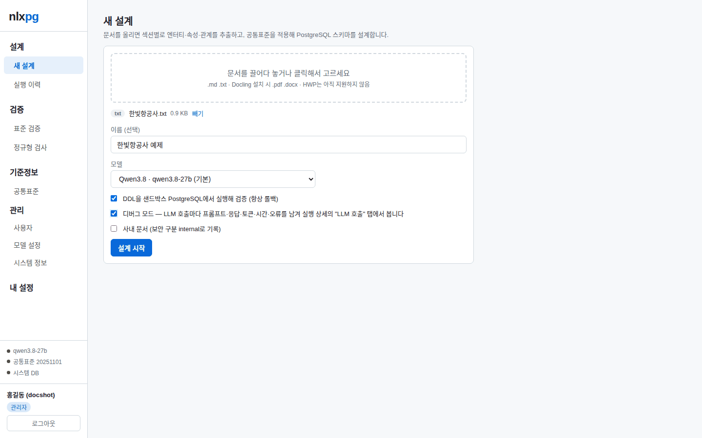

실행 이력 화면으로 바뀌고 진행 상황이 나옵니다. 진행 단계는 **추출 → 정합·모델링·표준 → 샌드박스 → 완료** 순입니다. 이 문서는 짧아서 1분 안팎이면 끝납니다(온프렘 Qwen3 기준 43초).

### 2단계: 요약 보기

끝나면 **요약** 탭이 열립니다.

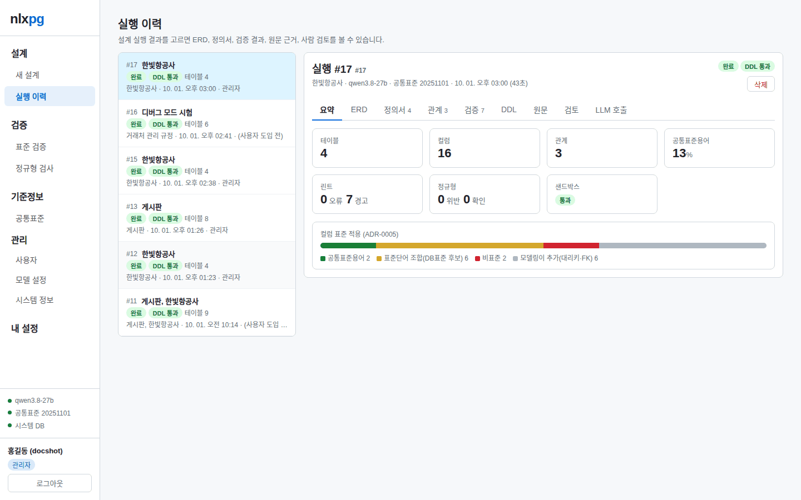

| 항목 | 결과 | 뜻 |
| --- | --- | --- |
| 테이블 / 컬럼 / 관계 | 4 / 16 / 3 | 회원, 신용카드, 비행기, 좌석 |
| 린트 | 오류 0, 경고 7 | 실행은 되지만 확인할 곳이 7군데 있습니다 |
| 정규형 | 위반 0, 확인 0 | 정규형 문제는 찾지 못했습니다 |
| 샌드박스 | 통과 | DDL이 PostgreSQL에서 실제로 실행됩니다 |
| 컬럼 표준 적용 | 공통표준 용어 2, 표준 단어 조합 6, 비표준 2, 모델링이 추가 6 | 막대 색으로 비율을 보여 줍니다 |

### 3단계: ERD와 정의서 보기

**ERD** 탭에서 테이블과 관계를 그림으로 봅니다.

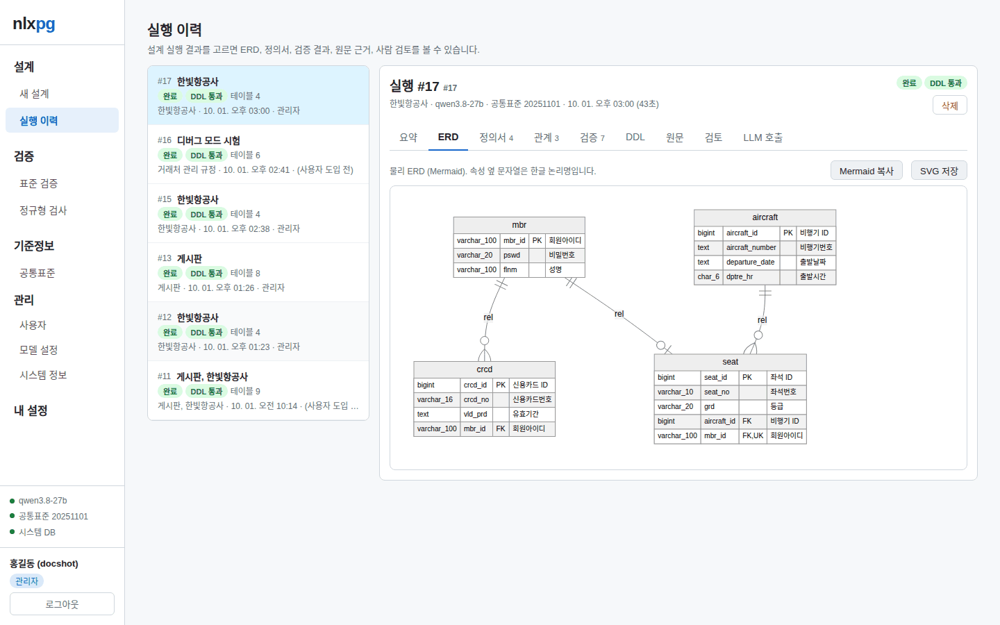

- 회원(`mbr`) 1 : N 신용카드(`crcd`): 회원 한 명이 신용카드를 여러 개 가집니다.
- 비행기(`aircraft`) 1 : N 좌석(`seat`): 비행기 하나에 좌석이 여러 개 있습니다.
- 회원 1 : 1 좌석: 좌석의 `mbr_id`에 UNIQUE가 붙었습니다. "회원 한 명은 좌석을 하나만, 한 좌석은 회원 한 명만"이라는 문장이 반영된 것입니다.

**정의서** 탭에서는 컬럼마다 논리명, 물리명, 타입, 도메인, 표준 판정, 키, NULL 허용 여부, 근거를 봅니다.

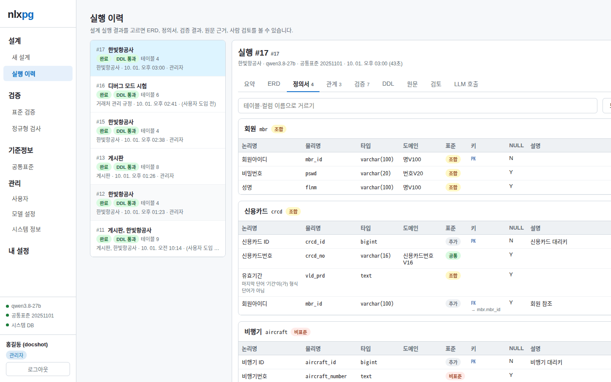

표준 칸의 표시는 다음과 같습니다.

| 표시 | 뜻 | 예 |
| --- | --- | --- |
| 공통 | 공통표준 용어를 그대로 썼습니다 | 신용카드번호 → `crcd_no` |
| 조합 | 표준 단어를 이어 만들었습니다(DB 표준 후보) | 회원아이디 → `mbr_id` |
| 기관 | 관리자가 추가한 기관 표준(이음동의어·단어·용어)을 써서 만들었습니다 | 비행기번호 → `arpln_no` (기관 이음동의어 비행기 → 항공기) |
| 비표준 | 표준으로 만들 수 없어 임시 이름을 붙였습니다 | 비행기번호 → `aircraft_number` (기관 표준이 없을 때) |
| 추가 | 문서에는 없고 모델링이 넣은 대리키·FK입니다 | 신용카드 ID → `crcd_id` |

**물리명은 LLM이 아니라 공통표준이 정합니다.** LLM은 문서에서 한글 이름(논리명)을 찾고 영문 이름도 제안합니다. 그다음 모델링 단계에서 한글 이름으로 공통표준을 찾아 물리명·도메인·타입을 정합니다. 예를 들어 LLM이 회원 테이블을 `member`, 성명을 `name`으로 냈어도 결과는 `mbr`, `flnm`이 됩니다. 이렇게 바뀐 경우 물리명 옆 괄호에 `flnm (name)`처럼 원래 제안이 표시됩니다(0.5.0 이후 실행부터). 표준으로 풀리지 않는 이름(비표준)은 LLM이 낸 영문 이름을 그대로 씁니다.

### 4단계: 검증 결과를 보고 고칠 곳 찾기

**검증** 탭에는 샌드박스 결과, 정규형, 린트가 나옵니다.

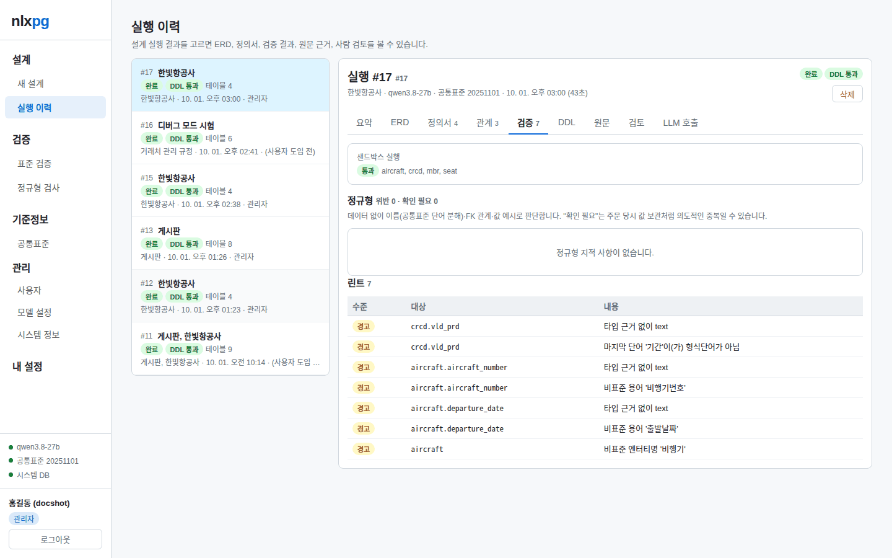

이 예제의 경고 7개와 화면만으로는 보이지 않는 문제를 정리하면 다음과 같습니다. 설계 초안을 검토할 때 이런 순서로 봅니다.

| 확인할 곳 | 무엇이 문제인가 | 고치는 방향 |
| --- | --- | --- |
| `aircraft.departure_date` (출발날짜) | 공통표준은 날짜를 "일자"로 씁니다. 그래서 비표준 용어가 됐고 타입도 `text`가 됐습니다 | "출발일자"는 공통표준 용어입니다. 바꾸면 `dptre_ymd date`(도메인 연월일C8)가 됩니다 |
| `aircraft.aircraft_number` (비행기번호) | "비행기"가 표준 단어가 아닙니다. 엔터티명 "비행기"도 비표준 경고가 났습니다 | "항공기번호"는 공통표준 용어(`arpln_no`)입니다. 문서를 고치거나, 관리자가 기관 이음동의어 "비행기 → 항공기"를 추가하면(8장) 문서를 그대로 두고도 `arpln`, `arpln_no`가 됩니다 |
| `crcd.vld_prd` (유효기간) | "기간"은 형식단어가 아니라 타입 근거가 없습니다 | 카드 유효기간은 보통 년월이므로 "유효연월"(공통표준 용어 `vld_ym char(6)`)로 바꿉니다 |
| 좌석과 비행기 | 문서에는 "좌석은 비행기가 없으면 의미가 없다"고 했습니다(약한 엔터티) | 지금은 좌석이 별도 대리키를 가집니다. (비행기, 좌석번호)를 키로 하는 식별 관계가 맞는지 판단합니다 |
| 회원 비밀번호 | `pswd varchar(20)`으로 평문 저장을 전제합니다 | 실제 설계에서는 해시를 저장하도록 타입과 설명을 고칩니다 |

이렇게 nlxpg는 **초안**을 만듭니다. 문서의 표현(출발날짜, 비행기)이 그대로 이름이 되므로, 표준 용어를 쓰면 결과가 좋아집니다. 문서를 고쳐 다시 실행해 결과를 비교하는 것도 좋은 방법입니다.

### 5단계: 검토 점수 남기기

**검토** 탭에서 6개 항목에 1~5점을 매기고 의견을 남깁니다(5장). 예를 들어 "출발날짜 → 출발일자, 좌석 식별 관계 검토 필요"처럼 적습니다.

---

## 3. 새 설계

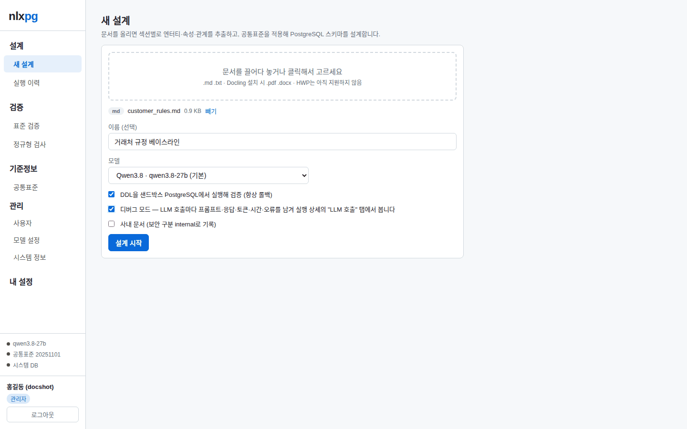

| 항목 | 설명 |
| --- | --- |
| 문서 | `.md`, `.txt`. 서버에 문서 파싱 도구(Docling)가 설치돼 있으면 `.pdf`, `.docx`, `.pptx`, `.html`도 됩니다. **HWP/HWPX는 아직 안 됩니다.** 여러 파일을 함께 올리면 하나의 스키마로 합칩니다. 목록의 **빼기**로 지웁니다 |
| 이름 | 실행 이력에 보일 이름입니다(선택) |
| 모델 | 설계에 쓸 LLM입니다. `(기본)`이 관리자가 정한 기본 모델입니다. `외부 API`가 붙은 모델은 아래 주의를 봅니다 |
| 샌드박스 검증 | 만든 DDL을 PostgreSQL 임시 스키마에서 실제로 실행해 봅니다. 항상 롤백하므로 아무것도 남지 않습니다. 켜 두기를 권합니다 |
| 디버그 모드 | LLM 호출마다 보낸 프롬프트, 받은 응답, 토큰, 시간, 오류를 남깁니다. 결과가 이상하거나 실패했을 때 켭니다 |
| 사내 문서 | 사내 문서면 체크합니다. 문서가 "사내" 등급으로 기록되고, 외부 API 모델을 쓸 수 없습니다 |

**문서를 잘 쓰는 법**
- 제목(`#`, `##`)이나 "제3조" 같은 조항으로 나눠 두면 섹션 단위로 정확하게 읽습니다.
- 값 예시를 적으면 타입과 길이가 정확해집니다. 예: 주문일자(예: 2026-09-30), 사업자등록번호(예: 123-45-67890)
- 공통표준 용어를 쓰면 표준 적용 비율이 올라갑니다. 예: 날짜 → 일자, 이름 → 명

> **외부 API 모델(Claude 등)을 쓸 때 주의**
> 외부 API 모델을 고르면 올린 문서 내용이 외부 회사(Anthropic)로 전송됩니다. 그래서 경고가 뜨고 **사내 문서** 체크가 꺼진 채 잠깁니다. 사내 문서에는 쓰지 말고, 공개 문서나 시험 문서에만 씁니다. 사내 문서로 표시된 실행은 서버도 거부합니다.

---

## 4. 실행 결과 보기

**실행 이력**의 왼쪽 목록에서 실행을 고릅니다. 상태는 **진행 중**, **완료**, **실패** 중 하나로 나오고, DDL이 샌드박스를 통과했으면 **DDL 통과**가 붙습니다.

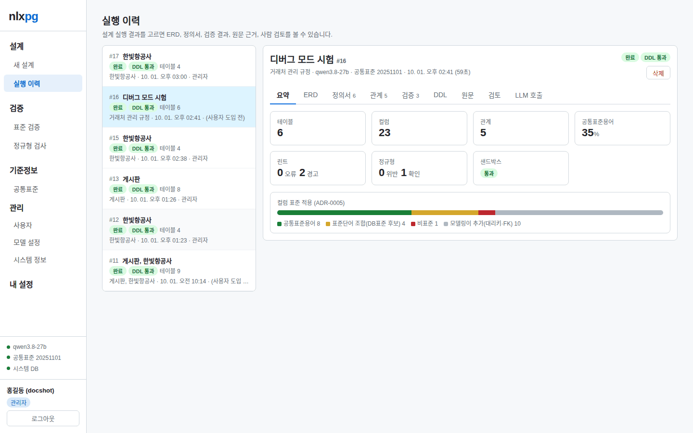

| 탭 | 내용 |
| --- | --- |
| 요약 | 테이블·컬럼·관계 수, 공통표준 용어 비율, 린트, 정규형, 샌드박스, 컬럼 표준 적용 막대 |
| ERD | Mermaid ERD입니다. **Mermaid 복사**, **SVG 저장**을 쓸 수 있습니다 |
| 정의서 | 테이블별 컬럼 표입니다. 위쪽 칸으로 이름을 거르고, 표준 판정(공통·조합·비표준·추가)별로 볼 수 있습니다 |
| 관계 | 관계 이름, 카디널리티, FK, 근거 |
| 검증 | 샌드박스 결과, 정규형(위반·확인 필요), 린트(오류·경고) |
| DDL | 복사, `.sql` 내려받기, **표준 검증**(6장으로 바로 이동) |
| 원문 | 올린 문서 본문 |
| 검토 | 사람 검토 점수(5장) |
| LLM 호출 | 디버그 모드로 실행했을 때만 나옵니다 |

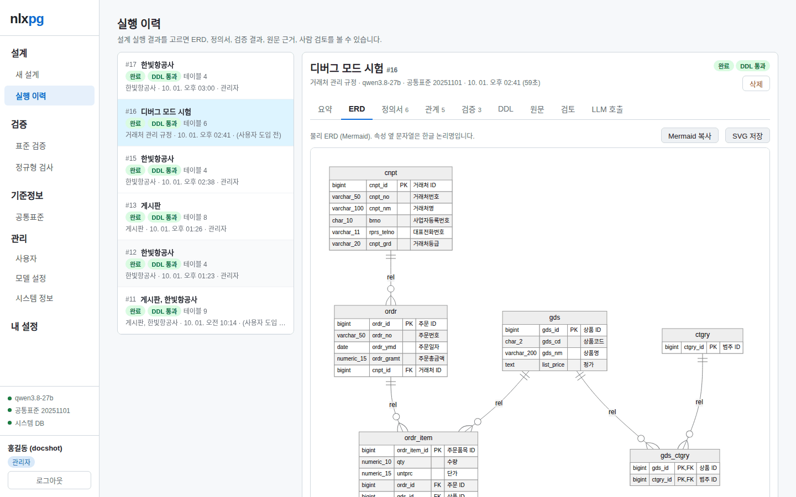

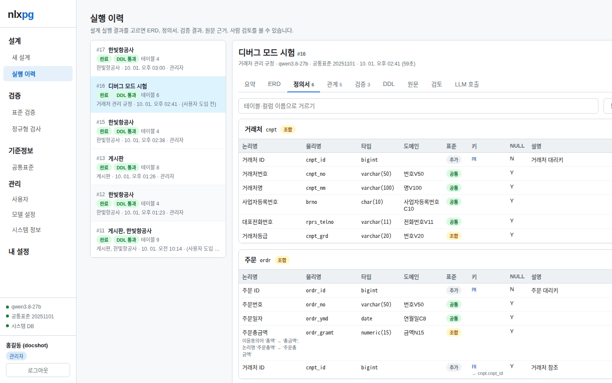

### 근거 따라가기

정의서와 관계의 **근거** 칸에는 그 항목이 나온 문서의 절이 적혀 있습니다. 누르면 **원문** 탭으로 옮겨 해당 절을 노란색으로 표시합니다.

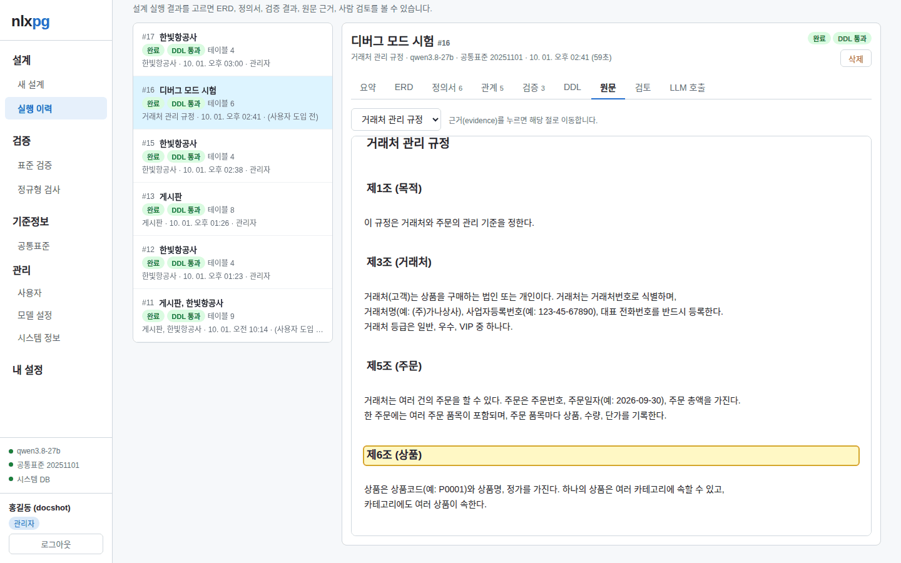

### 검증 탭

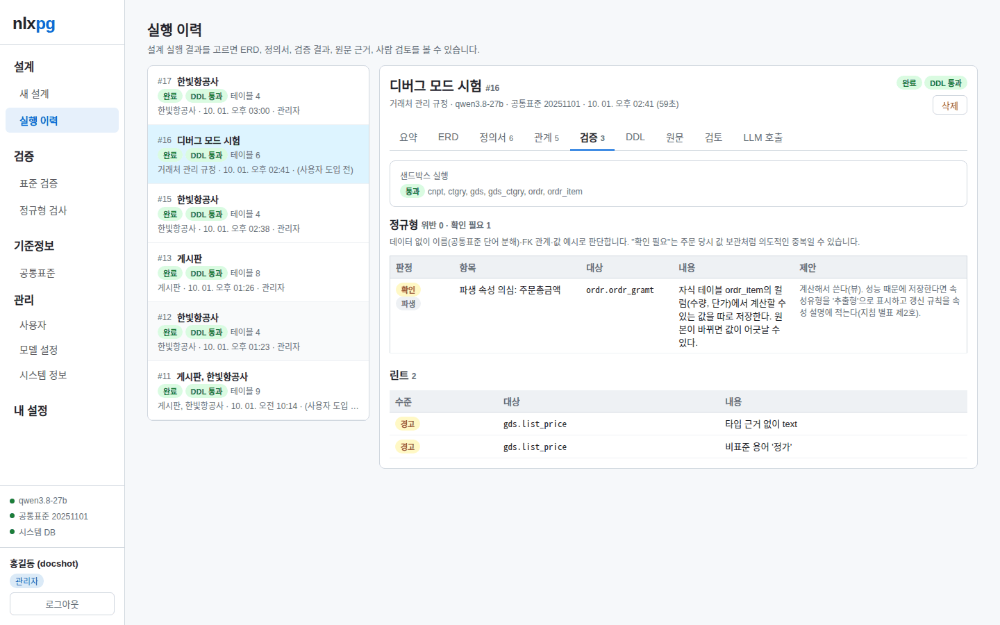

- **샌드박스**가 실패면 DDL 오류 메시지가 나옵니다.
- **정규형**의 "위반"은 고쳐야 할 가능성이 높습니다. "확인 필요"는 의도적인 중복(예: 주문 당시 금액 보관)일 수 있으니 판단해서 봅니다. 자세한 내용은 7장에 있습니다.
- **린트** 경고는 주로 "타입 근거 없이 text"(값 예시가 없음), "비표준 용어" 같은 것입니다.

### 디버그: LLM 호출

디버그 모드로 실행하면 **LLM 호출** 탭이 생깁니다. 결과가 없는 실패 화면에도 같은 목록이 나옵니다.

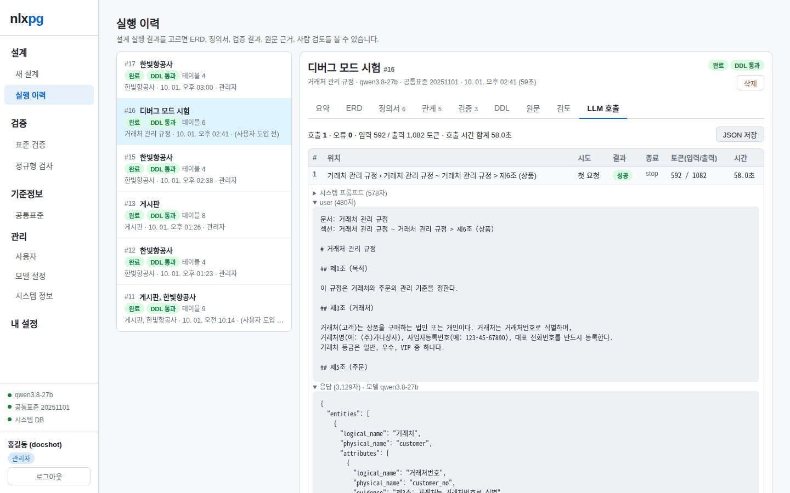

- 위쪽에 호출 수, 오류 수, 잘린 응답 수, 입력·출력 토큰, 시간 합계가 나옵니다.
- 행을 누르면 시스템 프롬프트, 보낸 문서 조각, 받은 응답(JSON)을 볼 수 있습니다.
- **결과**가 "검증 실패"면 LLM이 정해진 형식을 어겨 한 번 더 요청한 것입니다. 이때 시도 칸에 "수정 1"이 붙습니다.
- 종료가 `length`나 `max_tokens`이고 "잘림"이 표시되면 응답이 길이 제한에 걸린 것입니다. 관리자에게 알립니다.
- **JSON 저장**으로 전체를 받아 관리자에게 전달할 수 있습니다.

### 실행 삭제

결과 화면 오른쪽 위의 **삭제**를 누릅니다. 검토 점수, 이 실행만 쓰던 원문, 업로드 파일, 디버그 기록이 함께 지워지고 되돌릴 수 없습니다. 진행 중인 실행은 지울 수 없습니다.

---

## 5. 사람 검토

결과의 **검토** 탭에서 항목마다 1~5점을 매기고 **저장**합니다. 여러 사람이 검토하면 평균이 함께 나옵니다.

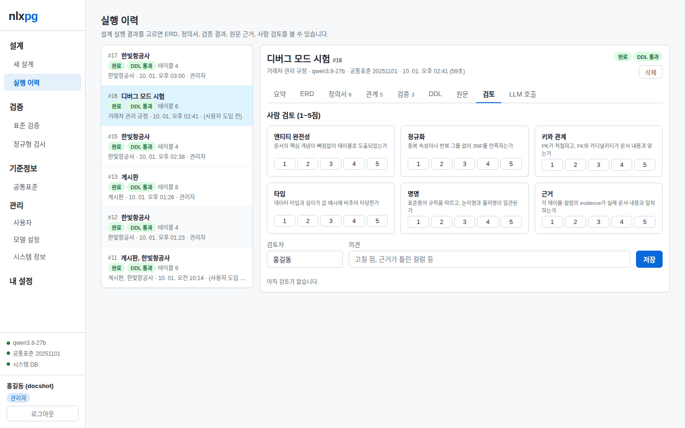

| 항목 | 보는 것 |
| --- | --- |
| 엔티티 완전성 | 문서의 핵심 개념이 빠짐없이 테이블이 됐는가 |
| 정규화 | 중복 속성이나 반복 그룹 없이 3NF를 만족하는가 |
| 키와 관계 | PK가 적절하고, FK와 카디널리티가 문서 내용과 맞는가 |
| 타입 | 데이터 타입과 길이가 값 예시에 비추어 타당한가 |
| 명명 | 표준용어 규칙을 따르고, 논리명과 물리명이 일관된가 |
| 근거 | 각 테이블·컬럼의 근거가 실제 문서 내용과 맞는가 |

검토 점수는 nlxpg의 품질을 재는 기준으로 쓰입니다. 의견란에 고칠 점을 구체적으로 적어 주세요.

---

## 6. 표준 검증

이미 있는 스키마의 컬럼이 공통표준을 얼마나 지키는지 검사합니다. 결과는 공공데이터베이스 표준화 관리 매뉴얼의 [표 Ⅲ-2] 비표준 데이터 매핑정보 형식입니다.

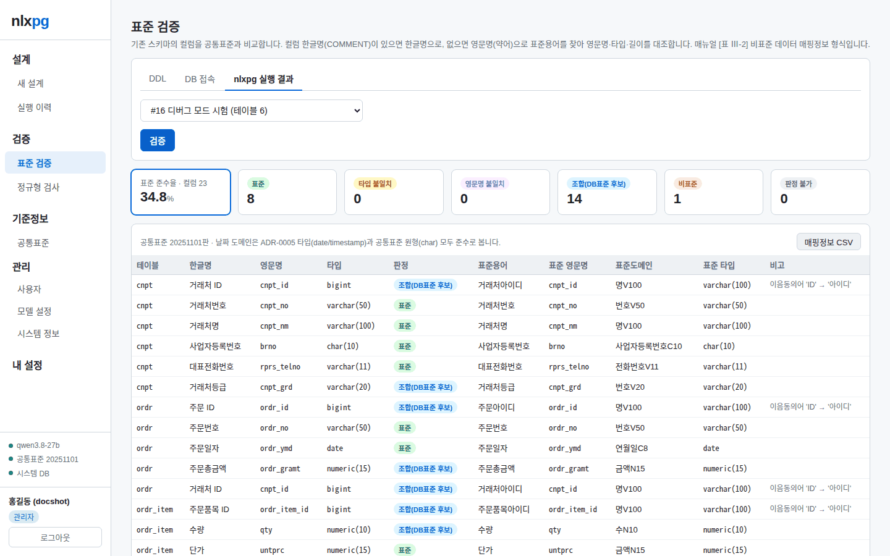

검사할 대상을 세 가지 중 하나로 고르고 **검증**을 누릅니다.

| 탭 | 대상 |
| --- | --- |
| DDL | `CREATE TABLE` 문을 붙여 넣거나 파일(`.sql`)에서 불러옵니다. 한글명은 `COMMENT ON COLUMN ... IS '거래처명'`에서 읽습니다. `public.x`처럼 스키마를 붙인 DDL은 인식하지 못합니다 |
| DB 접속 | 운영 DB의 접속 문자열과 스키마를 넣습니다. 컬럼·타입·코멘트만 읽고, 접속 문자열은 저장하지 않습니다 |
| nlxpg 실행 결과 | 실행을 고릅니다. 결과 화면 DDL 탭의 **표준 검증** 버튼으로도 옵니다 |

결과 위쪽 카드에 **표준 준수율**과 판정별 개수가 나옵니다. 카드를 누르면 그 판정만 거릅니다.

| 판정 | 뜻 |
| --- | --- |
| 표준 | 공통표준 용어와 영문명·타입이 맞습니다 |
| 타입 불일치 | 용어는 맞지만 타입이나 길이가 표준 도메인과 다릅니다 |
| 영문명 불일치 | 용어는 맞지만 영문명(물리명)이 다릅니다 |
| 조합(DB표준 후보) | 표준 단어 조합으로는 만들 수 있습니다. 기관 DB 표준 용어로 등록할 후보입니다 |
| 기관 표준 | 기관 추가 표준으로 찾았고 영문명도 맞습니다. 표준 준수율에는 넣지 않고 따로 셉니다 |
| 비표준 | 표준 단어로 만들 수 없습니다 |
| 판정 불가 | 한글명도 영문명도 알아볼 수 없습니다 |

- 한글명(코멘트)이 없으면 영문명(약어)으로 표준 용어를 거꾸로 찾고, 비고에 "영문명으로 찾음"이라고 표시합니다.
- **매핑정보 CSV**로 결과를 내려받아 표준화 작업에 씁니다.

---

## 7. 정규형 검사

설계 결과를 골라 정규형 문제를 찾습니다. 데이터 없이 이름(공통표준 단어 분해), FK 관계, 값 예시로 판단합니다.

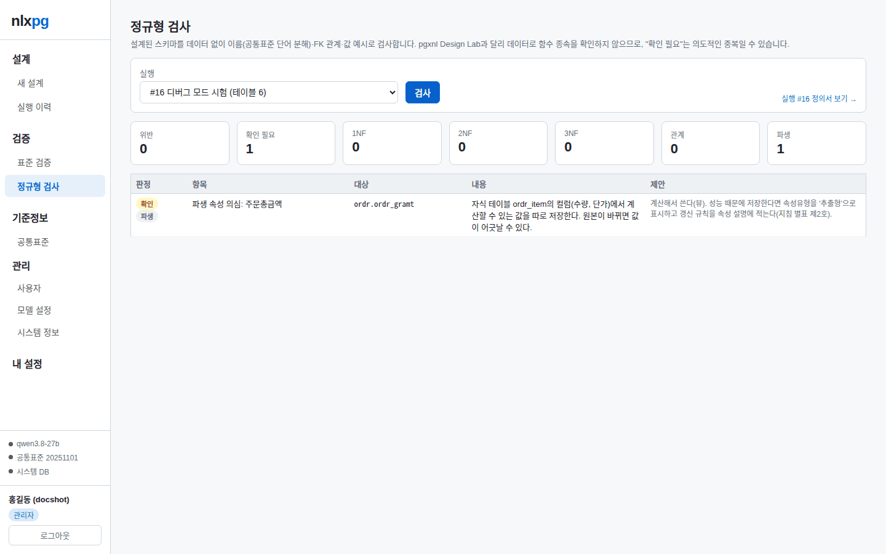

| 구분 | 찾는 것 |
| --- | --- |
| 1NF | 반복 그룹(전화번호1, 전화번호2…), 여러 값을 담는 컬럼 |
| 2NF | 복합키의 일부에만 종속된 컬럼 |
| 3NF | 다른 테이블의 값을 복사해 둔 컬럼, 코드와 코드명이 함께 있는 경우 |
| 관계 | FK가 빠진 것으로 보이는 관계 |
| 파생 | 다른 컬럼에서 계산할 수 있는 값을 저장한 컬럼(예: 주문총금액) |

각 항목에는 **제안**(고치는 방법)이 붙습니다. "확인 필요"는 의도한 설계일 수 있으므로 판단해서 봅니다. 예를 들어 성능 때문에 저장하는 파생 값이면, 속성 유형과 갱신 규칙을 설명에 적으라고 안내합니다.

---

## 8. 공통표준 조회

설계와 표준 검증의 기준인 행정안전부 공공데이터 공통표준(2025-11-01 판)을 찾아봅니다.

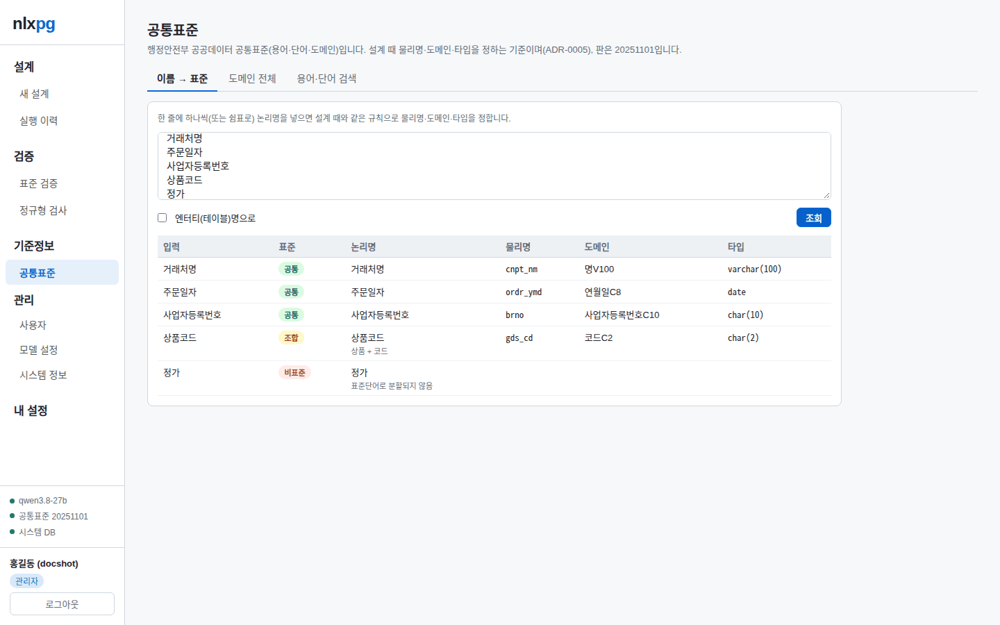

| 탭 | 쓰는 법 |
| --- | --- |
| 이름 → 표준 | 한 줄에 하나씩 이름을 넣고 **조회**를 누릅니다. 설계 때와 같은 규칙으로 표준 판정, 물리명, 도메인, 타입을 보여 줍니다. 테이블 이름이면 **엔터티(테이블)명으로**를 체크합니다 |
| 도메인 전체 | 그룹별 도메인 목록과 nlxpg가 쓰는 PostgreSQL 타입, 그 도메인을 쓰는 용어 수 |
| 용어·단어 검색 | 공통표준 용어, 단어, 도메인을 검색합니다. 기관 항목에는 **기관** 표시가 붙습니다 |
| 기관 추가분 | 기관이 추가한 이음동의어·단어·용어 목록입니다(아래) |

문서를 쓰기 전에 이름을 조회해 보면 좋습니다. 예를 들어 "출발날짜"는 비표준이지만 "출발일자"는 공통표준 용어(`dptre_ymd`, `date`)이고, "비행기번호" 대신 "항공기번호"(`arpln_no`)를 쓰면 표준이 됩니다.

### 기관 추가분

공통표준에 없는 이름은 기관이 추가해 쓸 수 있습니다. 예를 들어 공통표준 단어에는 "비행기"가 없고 "항공기"만 있습니다. 이음동의어 "비행기 → 항공기"를 추가하면 문서에 "비행기번호"가 나와도 공통표준 용어 "항공기번호"(`arpln_no`)로 설계됩니다.

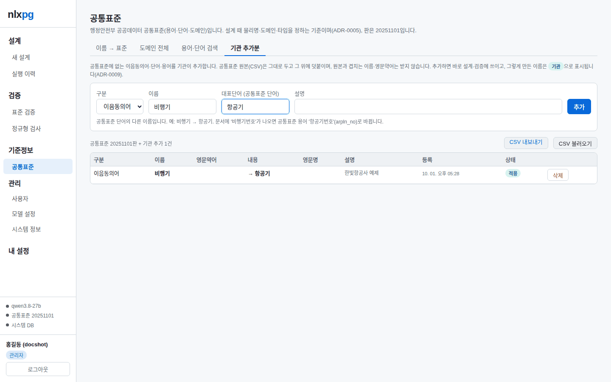

| 구분 | 넣는 것 | 예 |
| --- | --- | --- |
| 이음동의어 | 이름과 대표단어(공통표준 단어) | 비행기 → 항공기 |
| 단어 | 이름, 영문약어(다른 단어와 겹치면 안 됨), 영문명, 형식단어 여부와 도메인 분류 | 공통표준에 없는 업무 용어 |
| 용어 | 이름(단어로 나눌 수 있어야 함)과 공통표준 도메인. 영문약어는 단어 약어를 이어 자동으로 만듭니다 | 기관 고유 항목명 |

- **공통표준 원본은 바뀌지 않습니다.** 원본과 같은 이름이나 영문약어는 등록되지 않습니다. 오직 추가만 됩니다.
- 추가하면 바로 설계·검증·조회에 쓰입니다. 그렇게 만든 이름은 **기관**으로 표시돼 공통표준과 구분됩니다.

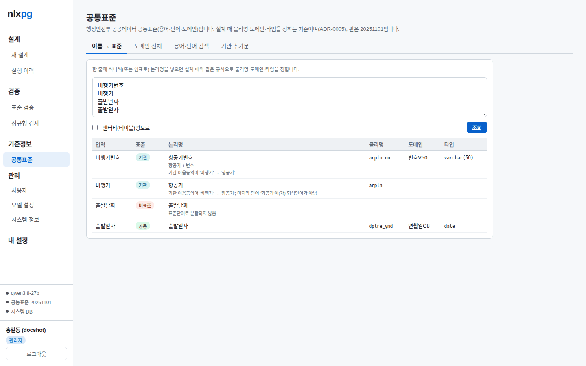

- 등록·삭제는 관리자만 할 수 있고(10장), 사용자는 목록을 봅니다. **CSV 내보내기**로 목록을 받을 수 있습니다.
- 상태가 **적용 안 됨**이면 공통표준 새 판에 같은 이름이 들어오는 등의 이유로 쓰이지 않는 항목입니다. 이유가 함께 나옵니다.
- 실행마다 그때 쓴 기관 항목이 기록됩니다. 나중에 항목을 바꿔도 이미 끝난 실행의 결과는 바뀌지 않습니다.

---

## 9. 내 설정

왼쪽 메뉴 아래의 **내 설정**에서 이름, 이메일, 비밀번호를 바꿉니다. 비밀번호는 현재 비밀번호를 넣고 새 비밀번호를 두 번 입력합니다. 바꾸면 다른 곳의 로그인이 끊깁니다.

---

## 10. 관리자 기능

관리자 계정에만 **관리** 메뉴가 보입니다.

### 사용자

- **사용자 추가**: 아이디, 이름, 이메일, 역할(관리자 또는 사용자)을 넣습니다. 초기 비밀번호는 직접 정하거나, 비워 두면 자동으로 만들어 **화면에 한 번만** 보여 줍니다. 받은 사람은 첫 로그인 때 비밀번호를 바꿉니다.
- **역할 변경, 사용 중지**: 사용 중지된 계정은 로그인할 수 없고, 만든 실행은 남습니다.
- **비밀번호 초기화**: 새 임시 비밀번호를 정하거나 자동으로 만듭니다. 그 사용자의 로그인은 모두 끊깁니다.
- 마지막 관리자는 사용자로 바꾸거나 사용 중지할 수 없습니다.

### 모델 설정

설계에 쓸 LLM을 **프로필**로 등록합니다. 설정은 시스템 DB에 저장되고, 키와 비밀번호는 암호화돼 화면에 다시 나오지 않습니다. LLM이 하나도 없으면 관리자가 처음 로그인할 때 이 화면으로 안내합니다.

1. **프로필 추가**를 누르고 제공자를 고릅니다.

   | 제공자 | 주소 예 | 넣을 것 |
   | --- | --- | --- |
   | OpenAI 호환 (vLLM 등) | `https://<vllm 서버>:8000/v1` | 모델 이름, API 키(서버가 요구할 때). 자체서명 인증서면 **인증서 검증**을 끕니다 |
   | watsonx | `https://<CPD 서버>/` 또는 `https://us-south.ml.cloud.ibm.com` | 프로젝트 ID. CPD면 계정·비밀번호, IBM Cloud면 API 키 |
   | Claude (Anthropic, 외부 API) | `https://api.anthropic.com` (자동 입력) | Anthropic API 키. 모델 기본값 `claude-opus-5-5` |

2. **저장하고 접속 시험**을 누릅니다. 목록 아래에 **성공**과 걸린 시간이 나오면 됩니다. 실패하면 오류 문구를 그대로 보여 줍니다.
3. 위쪽 **역할** 표에서 역할마다 쓸 프로필을 고릅니다.
   - **문서 추출**: 새 설계의 기본 모델입니다. 반드시 정해야 하고, 외부 API 프로필은 고를 수 없습니다.
   - **테스트 문서 작성**: 비워 두면 문서 추출과 같은 모델을 씁니다.
   - **생각 끄기**: Qwen3처럼 생각(reasoning) 과정을 거치는 모델은 이를 켜면 빠르고 길이 제한에 덜 걸립니다. Claude에서는 생각 깊이(effort)를 낮추는 것으로 대신합니다.

> 외부 API 프로필(Claude)은 목록에 **외부 API**로 표시됩니다. 사용자는 새 설계의 **모델**에서 직접 골라야 하고, 사내 문서에는 쓸 수 없습니다. 사내 문서만 다루는 서버라면 외부 API 프로필을 등록하지 않습니다.

### 기관 표준 관리

**기준정보 → 공통표준 → 기관 추가분** 탭에서 관리합니다(8장). 관리자에게만 입력란과 **CSV 불러오기**가 보입니다.

1. **구분**을 고르면 그에 맞는 입력란이 나옵니다. 입력란 아래에 구분별 설명이 있습니다.
2. **추가**를 누르면 공통표준 원본·기존 기관 항목과 겹치는지 검사합니다. 겹치면 이유를 알려 주고 등록하지 않습니다.
3. 기관 용어가 쓰는 기관 단어는 지울 수 없습니다. 용어를 먼저 지웁니다.
4. **CSV 불러오기**는 내보내기와 같은 형식(`구분,이름,영문약어명,영문명,설명,형식단어여부,도메인분류명,대표단어,도메인명`)을 받습니다. 이미 있는 항목은 건너뛰고, 문제가 있는 행은 이유를 보여 줍니다. 다른 서버로 옮기거나 기관 표준 신청 자료를 만들 때 씁니다.

### 시스템 정보

현재 서버 상태를 봅니다. 역할별 LLM, 공통표준 판과 건수, 시스템 DB와 샌드박스 상태, 설정 파일 위치가 나옵니다. 비밀번호와 키는 나오지 않습니다.

---

## 11. 문제 해결

| 증상 | 확인할 것 |
| --- | --- |
| "아이디 또는 비밀번호가 맞지 않는다" | 대소문자를 확인합니다. 그래도 안 되면 관리자에게 비밀번호 초기화를 요청합니다. 관리자 비밀번호를 잊었으면 서버에서 `nlxpg users passwd admin`을 실행합니다 |
| 새 설계에 "LLM이 설정되지 않아…"가 나옴 | 관리자가 **모델 설정**에서 문서 추출 역할을 정해야 합니다 |
| 파일을 올리면 오류 | PDF·DOCX는 서버에 문서 파싱 도구가 있어야 합니다(`pip install -e '.[parsing]'`). HWP는 아직 안 됩니다. `.md`나 `.txt`로 바꿔 올립니다 |
| 실행이 **실패** | 결과 화면의 오류 문구를 봅니다. 원인을 모르겠으면 **디버그 모드**로 다시 실행하고 **LLM 호출**의 JSON을 관리자에게 전달합니다 |
| "구조화 출력 검증 실패" | LLM이 두 번 모두 정해진 형식을 어겼습니다. 디버그 모드에서 응답이 잘렸는지(`length`) 봅니다. 잘렸다면 관리자가 모델 설정의 max_tokens를 늘리거나 **생각 끄기**를 켭니다 |
| Claude: "credit balance is too low" | Anthropic 계정의 API 크레딧이 없습니다. console.anthropic.com의 Billing에서 충전합니다(claude.ai 구독과는 별개입니다) |
| 샌드박스 **실패** | DDL 탭에서 해당 문장을 보고, 검증 탭의 오류 메시지를 확인합니다. 계속 실패하면 관리자에게 알립니다 |
| 표준 준수율이 낮음 | 대리키(`…_id`)는 아직 표준 용어가 아니어서 "조합"으로 나옵니다(알려진 한계). 문서에 공통표준 용어를 쓰면 올라갑니다(8장) |
| 진행 상황이 "진행 정보가 없습니다" | 서버가 재시작됐거나 CLI로 실행 중인 경우입니다. 실행 이력을 새로 고쳐 상태를 봅니다 |
